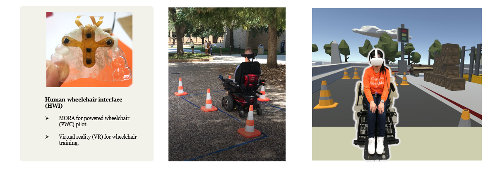

## About me

I am working on developing bi-directional human-machine interface for people with severe disability, VR-based system for healthcare applications, and designing experiment, interviews and questionnaires to evaluate system usability as well as the human factor. I am also interested in integrating sensory (e.g., haptic, vibrotactile, electrotactile) feedback for human motor learning and rehabilitation, and developing multi-sensor system to monitor user’s sleep quality. I am familiar with rapid prototype, embedded system development, and methods for quantitative and qualitative human-machine interaction evaluation.

## Eduaction

- **Texas A&M University, College Station**        Spring 2019 - Summer 2023
- Ph.D. in Electrical Engineering
- *Thesis: Multifunctional Intraoral Assistive Technology Driven by Bidirectional Human Machine Interface* 
- *Advisor: Hangue Park (Chair), Joenghee Kim (Co-chair)*
- **Texas A&M University, College Station**			Fall 2016 - Fall 2018
- Master of Computer Science	

## Experience

- **Quantitative Neuro Rehabilitation Lab, Texas A&M University**    	 			Spring 2019 - present
- Graduate Research Assistant
- **Integrated Neuro-Prosthesis Lab, Texas A&M University**   	  		 			   Fall 2018 - Present
- Graduate Research Assistant
- **Arbin Instruments, Texas**										    			                           01/2018 - 04/2018
- Software Engineering Intern
- **Center for Bioinformatics and Genomic Systems Engineering, Texas A&M University**		07/2017 - 10/2017
- Graduate Student Researcher 

## Research Projects

### Multifunctional Intraoral Assistive technology (MORA) with intuitive intraoral commands and sensory feedback

> 

> 
> We proposed a Multifunctional intraORal Assistive technology (MORA) that allows users to control the cursor on the screen by intuitive user-defined tongue commands
without any add-on tracers, and provides sensory feedback to further enhance the intuitiveness of the tongue control. We expect the enhanced intuitiveness of the
proposed AT will increase its acceptability to the people with severe disability. 
The advantages of intraoral assistive technology:
  • Support Multiple functionality (can be used as a general environment control interface).
  • Intraoral interface can be invisible to other people (privacy and dignity).
  • Robust, therefore less likely to be effected by the environment.
  • Intraoral muscle don’t fatigue as fast as other muscles.
  • Intraoral organs are controlled by cranial nerves, which is hardly damaged by SCI.
> 
> `Multifunctional assistive technology` `Intuitive command design`  `Biomedical device` `Hands-free controller` `Embedded system development` `Bidrectional Human-computer interface`

---
### Tongue-controlled hands-free assistive technology (intraoral module for MORA)
> 

> 
> We have developed an “intraoral module” for tongue-controlled assistive technologies for people withsevere disability to control their environment. And tested it’s basic functionality by doing some some computer access tasks.
> To test the basic functionality of computer access, we tested with 11 subjects for: (1) random command task (target command appeared on the screen in random order, participants need to issue the corresponding command as fast and accurate as possible) and (2) Maze navigation task (guide cursor from start to end as fast and accurate as possible). The result of Maze navigation showed that the average completion time of eleven participants was much faster than SNP, as good as TDS. With this design, the tongue movement inside the mouth can be successfully translated into directional commands for navigation tasks.
> 
> `Assistive technology` `Human-computer interface` `Biomedical device`  `Embedded system development`

---
### MORA as a Human-Wheelchair Interface(HWI)
 

 
I am working on developing a MORA-powered wheelchair (PWC) system for hands-free powered wheelchair pilot.Piloting the powered wheelchair without training is dangerous task, especially for hands-free controllers. When unintentional commands are given, a novice user may Colliding with Obstacles and get injured. Therefore we developed a VR wheelchair training environment.

`Virtual reality` `Human-computer interface` `Biomedical device` `Hands-free controller` `Embedded system development`

---
### Speech therapy using real-time closed-loop artificial feedback to the tongue 
 

 
The purpose of this study was to investigate the importance of providing an error-augmented sensory feedback with proper spatiotemporal resolution for training and enhancing complex tongue motor coordination during speech. We present a wearable intraoral system that uses (1) an intraoral palatal retainer to monitor the tongue movement by optical distance sensors and (2) to provide sensory feedback to the tongue by stimulators. If the subject contacts the undesired palatal area during pronunciation, they will get the stimulation as an error feedback on their tongue tip. The result justified our hypothesis that intrinsic sensory feedback can be an effective way for tongue motor learning in speech therapy.

`Error-augmented sensory feedbcak` `Tongue motor control` `Speech therapy` `Embedded system development` `Closed-loop system`

---
### Speech therapy using real-time closed-loop artificial feedback to the tongue 

To avoid the Midas touch effect, tongue commands are usually defined in a complex way to avoid confusion with the daily oral activities, these new tongue movement require a lot of training. To find the more effective way to training the tongue to learn new command, my objective was to test the effectiveness of visual and tactile assistance on tongue motor learning and motor control. A closed loop wearable intraoral device was developed to provide electrotactile and visual feedback. A dental retaienr was custom=-made for each subject. The dental retainer consists of an electrodes array. 

For visual training, an array of LEDs was shown on the computer screen, When one electrode was contacted, the corresponding LED would lighten up. The further away from the target, the brighter the color of the LED. By this visual cue, they need to find the target location by their tongue tip. For tactile training, different frequency electrical stimulation was provided to the tongue. The further away from the target, the higher the stimulation frequency. By the tactile sensation, they need to find the target location.
 
The result shows that both tactile and visual feedback improved tongue motor control ability. But looking at the post training session, tactile training leads to stronger retention than visual training. And although not significant, but tactile training reached learning plateau after 6 trails of trainig, whereas visual groups took 11 trials, suggesting that subjects are learning faster with tactile feedback.

`Electrotactile feedback` `Visual feedback` `Motor learning` `tongue` `Electrical stimulation` `Intraoral device` `Augmenting sensory feedbcak` 

